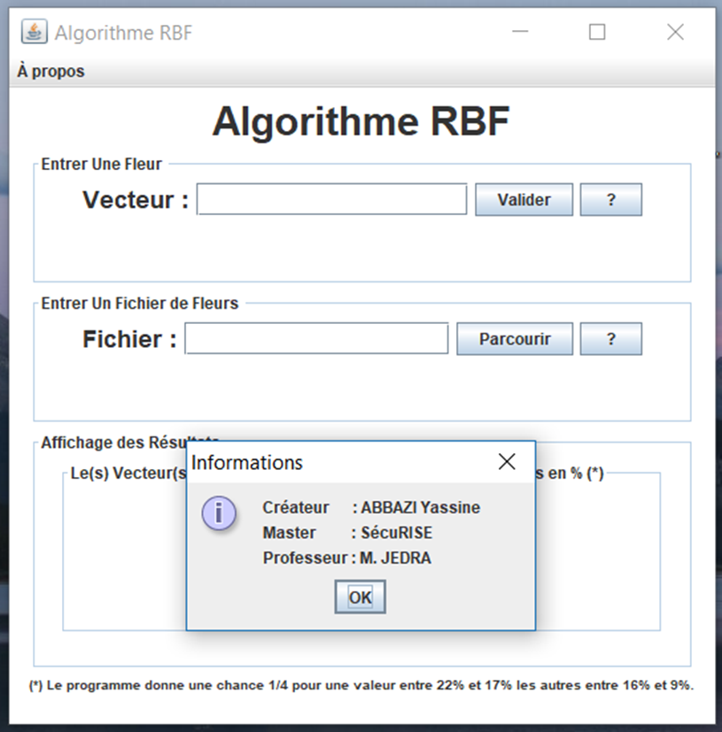
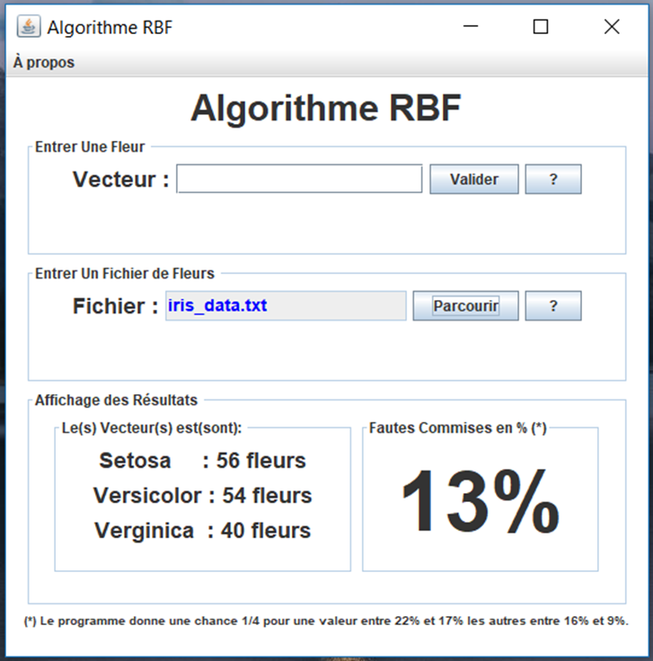

# Iris Classification using Neural Networks (RBF)
## Master's Degree projects (July 2012)

This is a program written in Java with a Human Machine Interface (HMI)

### How to use it:
To run the program execute _**"ReseauRBFjar.jar"**_ by double-clicking it, 
Go to > **A propos** (to show help)

Enter an excel file to show the miss-classification rate:

You can enter one single value (an observation) to predict its class.
